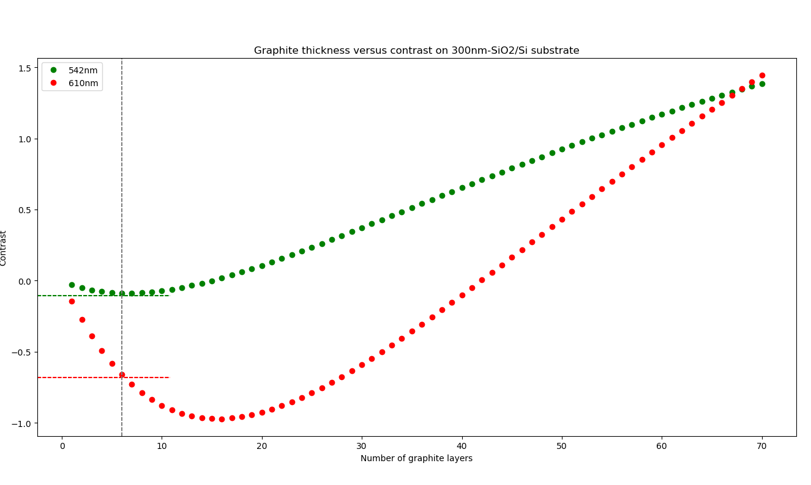
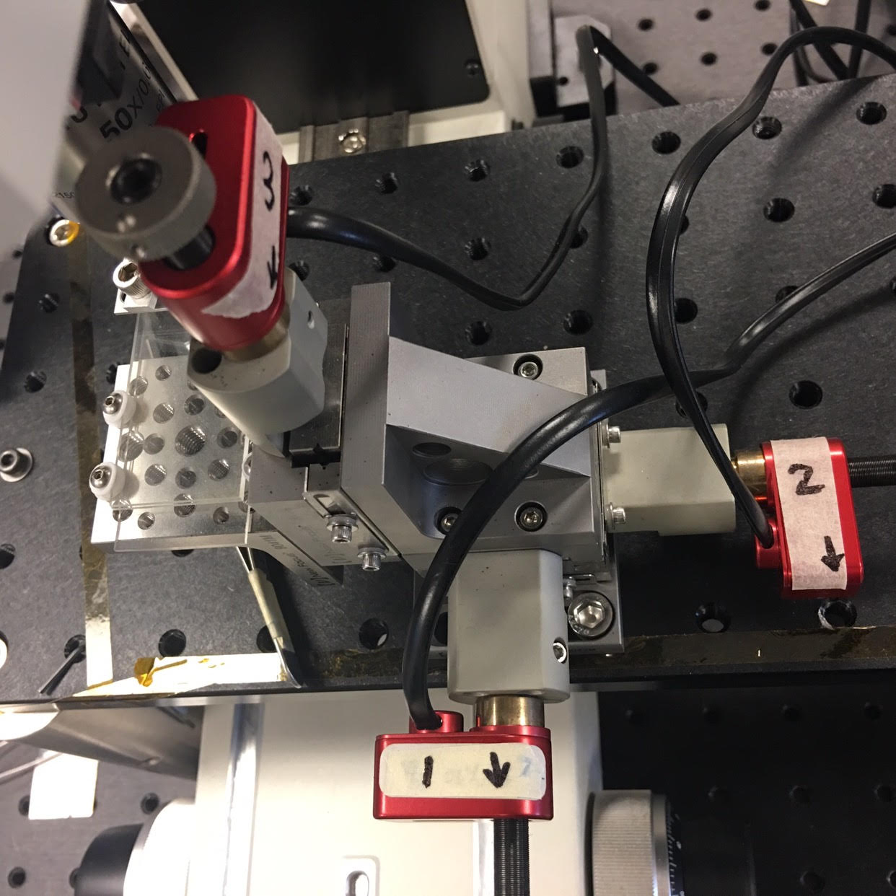
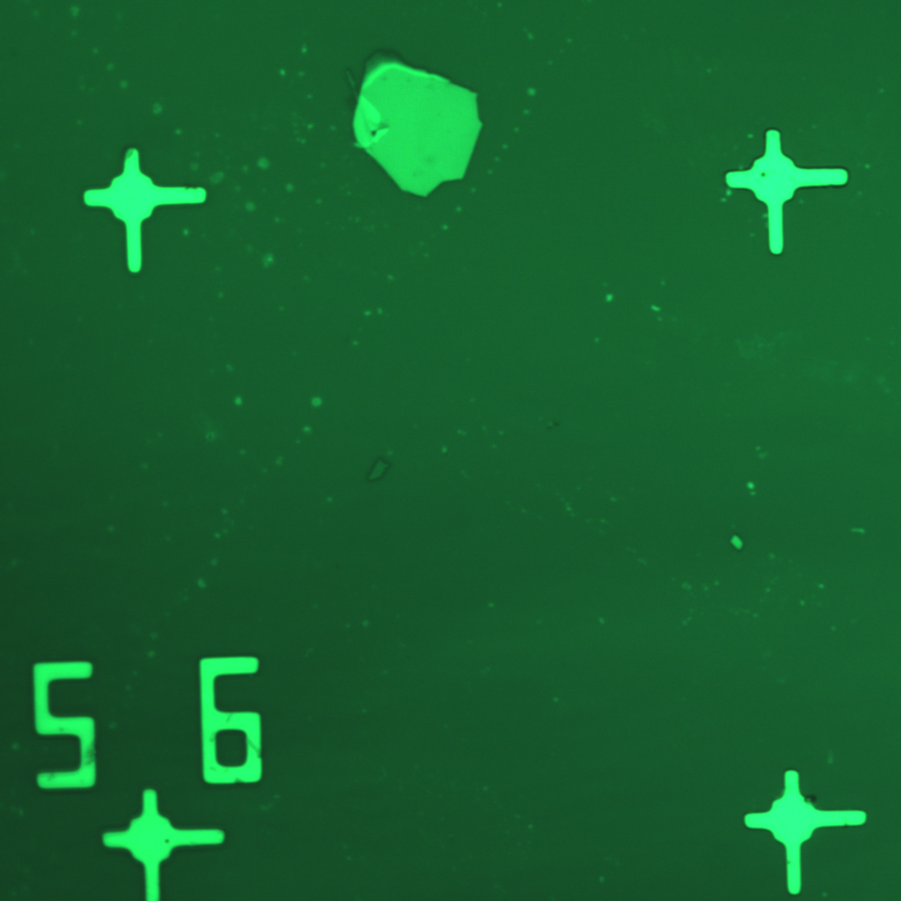
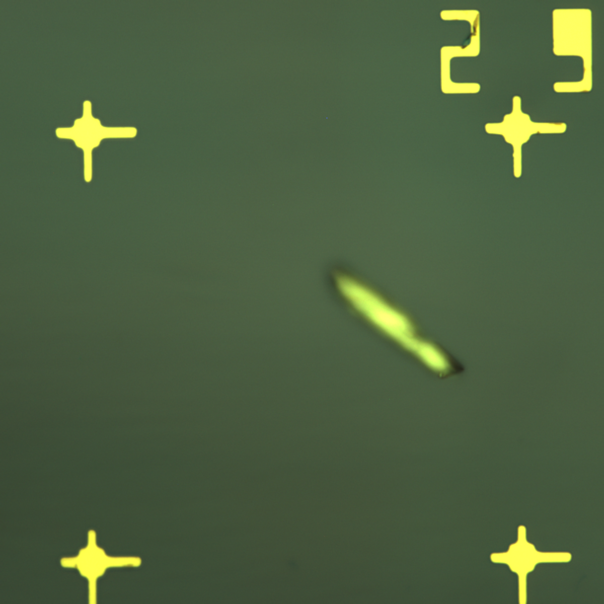
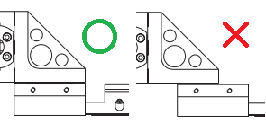

# Flakes
For automated sample scanning and stamping.

Last updated: August 2019 
___
## Prerequisites and Dependencies

[Python 3.6.x](https://www.python.org/downloads/release/python-368/) is required. Don't forget to "add Python to PATH" during or after the installation. 

Open command prompt (or Anaconda prompt) then copy and paste the following command to install the libraries:

```bash
pip install mkdocs opencv-python matplotlib PyQt5 pyusb scipy statsmodels pypiwin32 --user
```
Append the "--user" option if necessary.


We are using Nikon Eclipse FN1 Microscope equipped with DFK 33UX174 camera for image acquisition.  
You also need [a driver for the camera](https://www.theimagingsource.com/support/downloads-for-windows/device-drivers/icwdmuvccamtis33u/).

We use New Focus [Picomotor Controller](https://www.newport.com/medias/sys_master/software/software/h4b/he7/9139939803166/PicomotorApp-2.1.5.zip) and Piezo Linear Actuators for stage motion control and autofocusing.

For the moment, We only accept samples with lithographic coordinates.

<br/><br/><br/>
___
## A note on interpreting the results of thickness estimation (graphite only)



As you can see from the plot, the contrast-thickness relationship is not bijective. 

The red interpolating function assumes that all the flakes are **<= 15 layers** and gives you its best guess, which is obviously not realistic. The green interpolating function assumes that all the flakes are <= 40 layers.

Bottom Line: If you are looking for few-layer graphitic flakes, use red filter first and look for the darker flakes. Then run another iteration with ND or green filter for double checking. 

**Trust the thickness estimation from the red filter only if the flake is very dim (almost 'disappearing') at 542nm or appears blue-purple-ish under neutral density filters.**  

 
<br/><br/><br/>
___
## Setup Guide for Scanning<br/><br/>
### Step 1 - Sample placement

Connect picomotors to 8742 picomotor controller/driver:


Place your sample in the (approximately) 0.5cm by 0.5cm square slot on the sample holder. Please orient it this way:

      +++++
      +++++
      +++++ ↓
      
Make sure that the large arrow is at the bottom right corner, pointing towards you, aligned with the hand-drawn arrows marked on the picomotors.
      
Ideally, the grids on your sample should be orthogonal to the edges of the glass slide,
and the stages shold be orthogonal to the microscope platform. 
In other words, three sets of coordinates (Camera-Stage-Sample) should align.
Loosen and rotate the camera if necessary.<br/><br/><br/>

### Step 2 - Understanding the coordinate system 

You will be asked to provide four numbers (minX, minY, maxX, maxY) that specifies your 'area of interest' - a *rectangular* subset of the grid to be scanned. 

But what do those four integers mean?<br/><br/>

**TL;DR**

You only specify the starting and ending X and Y. You cannot specify x and y. 

**(minX, minY, maxX, maxY) are always inclusive! The area below and to the right (as seen from the binoculars) of maxX and maxY are included!!** 


<br/><br/><br/><br/>
**The long version**

The lithographic grids have numbered coordinates to help you locate the flakes. Those little asymmetrical crosses are 100 um apart from each other and we use **lower case x and y** to index them. 


There are also numers. They are ordered pairs like indicies of a matrix. Neighbouring 2-tuples are 500um apart from each other - we use **upper case X and Y** to index them.<br/><br/>


You may not agree, but just for now, let's assume X = row and Y = column. 

We insist that every 2-tuple (X, Y) represents a 500um by 500um area **below and to the right (as seen from the binoculars)** of this 2-tuple. 

Accordingly, every 4-tuple (X, x, Y, y) represents a 100um by 100um area **below and to the right (as seen from the binoculars)** of a cross.


> In other words, X grows when you move down by 500um; x grows when you move down by 100um; Y grows when you move towards the right by 500um; y grows when you move towards the right by 100um. 


> When x or y reaches 6, it will wrap back to 1 (not 0!!) and X or Y would increment by 1.


<br/><br/>

A few things that you've already figured out:

1. You only specify the starting and ending X and Y. You cannot specify x and y. Upon start-up they are always x=1 and y=1 with X and Y being your minX and minY. When the scan terminates they are always x=5, y=5 with X and Y being your maxX and maxY. 

2. **Only rectangular areas of interest are accepted.** Irregular unions of disjoint sets and 'staircase-like' areas are scary. Please opt for the least bounding rectangle instead (or do more than one iterations!)

3. We always start from the lower index corner and migrate towards he higher index corner.

4. The minumum you can scan is the 500um by 500um area below and to the right of your initial coordinates.
 <br/><br/>


Example 1: This area is called **X4x5_Y6y1**



Example 2: This area is called **X8x5_Y8y5**


Example 3: This area is called **X2x1_Y8y5**


Example 4: 

    To scan a full sample, enter minX=1, minY=1, maxX=8, maxY=8. 


Example 5: 

    To scan the area bounded by the numbers 22, 23, 32, 33, enter minX=2, minY=2, maxX=2, maxY=2. 
    This would be a 500um by 500um consisting of 25 little squares.

Example 6: 

    If you followed your intuition and mistakenly entered minX=2, minY=2, maxX=3, maxY=3
    It will scan the area bounded by 22, 24, 42, 44.
    An 1mm by 1mm area consisting of 100 little squares.

<br/><br/><br/>

### Step 3 - Position the axes and the sample holder
Now let's take a look at the binoculars. Move the sample holder and axes (with your fingers or a #3 allan key) around to find your 'initial coordinates', which should be the top-left corner of your area of interest.

When you are moving and locating your initial coordinates, please try to keep the two in-plane axes (X, Y) around the midpoint of their moving ranges as shown in the picture. 

Leave Z-axis as-is.



Play with the axes and the sample holder while keeping the grids as orthogonal as possible, until you can see your starting coordinate numbers (the ones you specified as minX and minY) at the __*centre*__ of the field.


<br/><br/><br/>
### Step 4: Fix your sample
Screw down the rod (it might block a small portion of your sample as it covers the rightmost edge of the sample slot).

It's a 'safety belt' to ensure that your sample remain seated when the motors drive it around. 

Random vibrational displacement caused by the motors (or your colleagues) has been a major source of misery so please do not skip this step.

<br/><br/><br/>
### Step 5: Ready to go!

FOCUS on that area and pull out the BINO-PHOTO slider. 

Turn on the picomotor controller. Make sure that the picomotor gears are not touching anything (i.e. their own wires, microscope objectives, etc.)

Some pop-up windows will ask for your help to reach the optimal brightness for your choice of filter and material.

Thank you for your patience! Don't be scared by its chirping sound and have fun with the rest of it!
<br/><br/><br/>
___
## Setup Guide for Stamping
not ready yet
